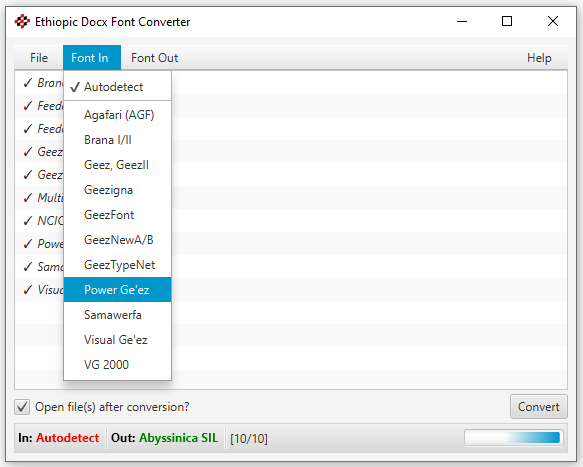

# Docx Converter for Legacy Ethiopic Font Encoding Systems

## About

Migrate Microsoft Word documents in pre-Unicode Ethiopic fonts into a Unicode font supporting Ethiopic script.
The converter presently provides support for eleven legacy (non-Unicode) systems and their respective fonts:

 * Agafari
   * AGF - Zemen
   * AGF - Dawit
   * AGF - Ejji Tsihuf
   * AGF - Rejim
   * AGF - Yigezu Bisrat
 * Brana 90 
   * Brana I
   * Brana II
 * Feedel
   * Geezigna
 * Feedel
   * Geez
   * GeezII
 * Feedel "New"
   * GeezA
   * GeezB
   * GeezNewA
   * GeezNewB
   * GeezSindeA
   * GeezSindeB
   * ZewdituA
   * ZewdituB
   * GeezNet
 * GeezFont
   * GeezAddis
   * geezBasic
   * geezDirib
   * geezLong
   * GeezThin
 * Ge'ezSoft
   * GeezType
   * GeezTypeNet
 * Power Ge'ez
   * Ge'ez-1
   * Ge'ez-2
   * Ge'ez-3
   * Ge'ez-1 Numbers
 * Samawerfa
   * Addis98
   * Blknwt98
 * Visual Ge'ez 
   * VG2 Agazian
   * VG2 Main
   * VG2 Titles
   * VG Geez Numbers
 * Visual Ge'ez 2000
   * VG2000 Agazian
   * VG2000 Main
   * VG2000 Titles

The conversion mappings come directly from the long defunct [LibEth](http://libeth.sourceforge.net) C language library which
supported conversion of [many more legacy encoding systems](http://libeth.sourceforge.net/CharacterSets.html).  Support for additional
encodings systems can be ported from LibEth as the need arises. 
Please feel free to [request support](https://github.com/geezorg/DocxConverter/issues) for additional systems.

This repository may be imported into [Eclipse](http://www.eclipse.org) as a simple [Maven](https://maven.apache.org/) Java project.
The "Eclipse IDE for Java Developers" download option will include both Maven and Git integration, no additional installation will
be needed to build this project.  Maven in turn will retrieve all dependencies, primarily the [docx4j](https://www.docx4java.org/)
(6.1.0) and [ICU](http://site.icu-project.org/) (63.1) and Java libraries.

## Download

* [Windows EXE (Java bundled internally)](https://github.com/geezorg/DocxConverter/releases/download/v0.8.0/DocxConverter-0.8.0.exe)
* [Windows MSI (Java bundled internally)](https://github.com/geezorg/DocxConverter/releases/download/v0.8.0/DocxConverter-0.8.0.msi)
* [Mac DMG (Java bundled internally)](https://github.com/geezorg/DocxConverter/releases/download/v0.8.0/DocxConverter-0.8.0.dmg)
* [Jar (Best if Java already installed)](https://github.com/geezorg/DocxConverter/releases/download/v0.8.0/DocxConverter-0.8.0-full-gui.jar)
* [Read the notes on the latest updates.](https://github.com/geezorg/DocxConverter/releases/tag/v0.8.0)

## Usage

1. Select one or more Microsoft Word files *(files must be in .docx format)*.
2. Select the "Font In" *(optional, supported fonts will be autodetected)*
3. Select the "Font Out"
4. Click "Convert File(s)"
5. Converted files will automatically open.

If your document contains more than one legacy font system, you may convert the fonts one at a time where
the output document of the first conversion is used as the input document of the 2nd conversion and so on.

In the GitHub the "[releases](https://github.com/geezorg/DocxConverter/releases/)" folder you can find and download the
"DocxConverter-0.8.0-full-gui.jar" file. This version contains the converter and all of its dependencies (jar libraries).
Double clicking the jar file will launch a user interface where fonts and files may be selected via mouse and menus.

Output files will have the name of the selected output font appended to them.  For example
if "Abyssinica SIL" (the default) is selected as the output font name, an input file named
"MyFile.docx" will have the output name "MyFile-Abyssinica-SIL.docx".

The application uses the [Abyssinica SIL](http://software.sil.org/abyssinica/download/) font as a default for output.
The "Nyala" font that comes with Microsoft Windows and "Kefa" which comes OSX are other output options. The full list
of output font options:

* Abyssinica SIL
* Bembino
* Brana
* Kefa
* GS Mahtem Unicode
* Nyala
* Power Geez Unicode1

If your desired font is not available for output, you may still use it by selecting text and changing the font style
to another Unicode compliant font for Ethiopic.

### Limitations

The Docx Converter has been tested on a small sample of Amharic documents that covers most, but not all of, the
Ethiopic syllabary.  Testing is thus not comprehensive and is limited by the corpus sample available for testing.
Conversion errors will likely be found as new documents uses letters not found in the testing corpus.

Conversion issues may also be found when documents produced by additional versions of Microsoft Word are tested,
or for documents produced by other word processors that support the .docx format.  Conversion may also fail for
more complex formatting such as for tables which have not been tested.

Issues can be reported to the author directly, or via the GitHub [issues tracker](https://github.com/geezorg/DocxConverter/issues)
for the project.

### Troubleshooting

If nothing happens when you double click the "DocxConverter-0.8.0-full-gui.jar" file, and you are certain that
Java is installed on your Windows system, you likely need to fix the Window's registry.  Try downloading and launching
[Jarfix](https://johann.loefflmann.net/en/software/jarfix/) to fix the registry.
