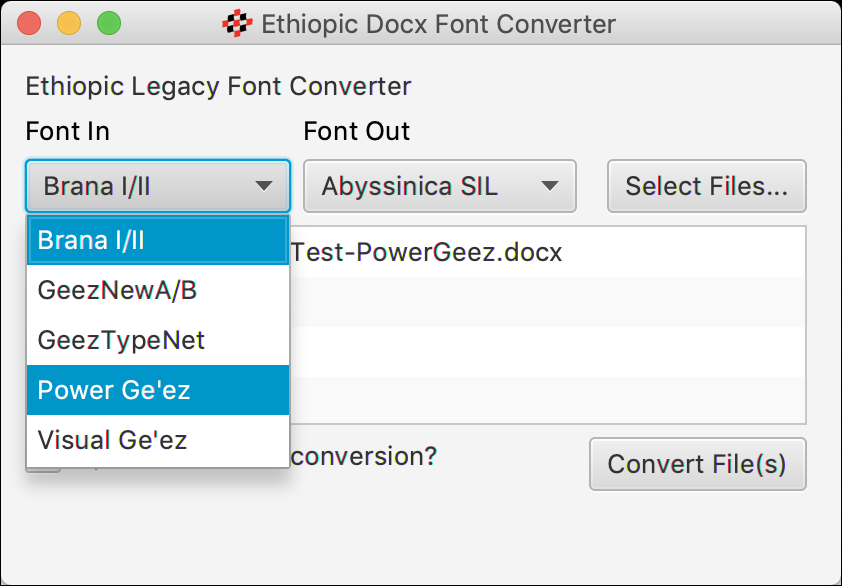

# Docx Converter for Legacy Ethiopic Font Encoding Systems


## About

This repository may be imported into [Eclipse](http://www.eclipse.org) as a simple [Maven](https://maven.apache.org/) Java project.
The "Eclipse IDE for Java Developers" download option will include both Maven and Git integration, no additional installation will
be needed to build this project.  Maven in turn will retrieve all dependencies, primarily the [docx4j](https://www.docx4java.org/)
(6.1.0) and [ICU](http://site.icu-project.org/) (63.1) and Java libaries.

The converter presently provides support for five legacy (non-Unicode) systems, Brana (I &amp; II),  Feedel Ge'ez (New &amp; B).
Ge'ezSoft (GeezTypeNet), Power Ge'ez (Ge'ez-1, Ge'ez-1 Numbers) and Visual Ge'ez (VG2 Main, VG Geez Numbers).
The conversion mappings come directly from the long defunct [LibEth](http://libeth.sourceforge.net) C language library which
supported conversion of [many more legacy encoding systems](http://libeth.sourceforge.net/CharacterSets.html).  Support for additional
encodings systems can be porrted from LibEth as the need arrises. Please feel free to request support for additional systems.


## Usage (Executable Jar with GUI)

1. Select one or more Microsoft Word files using the same font *(files must be in .docx format)*.
2. Select the "Font In"
3. Select the "Font Out"
4. Click "Convert File(s)"
5. Converted files will automatically open.




In the GitHub the "[releases](https://github.com/geezorg/DocxConverter/releases/)" folder you can find and download the "DocxConverter-0.5.0-full-gui.jar" file. This version
contains the converter and all of its dependencies (jar libraries).  Double clicking the jar file will launch a user
interface where fonts and files may be selected via mouse and menus.

Output files will have the name of the selected output font appended to them.  For example
if "Abyssinica SIL" (the default) is selected as the output font name, an input file named
"MyFile.docx" will have the output name "MyFile-Abyssinica-SIL.docx".

The application uses the [Abyssinica SIL](http://software.sil.org/abyssinica/download/) font as a default for output.
The "Nyala" font that comes with Microsoft Windows and "Kefa" which comes OSX are other output options.  These
fonts maybe substuited for any other Unicode compliant font for Ethiopic.


### Limitations

Some issues will remain...


## Command Line Usage Examples

% java -cp [path to libaries]  &lt;system&gt; &lt;file-in&gt; &lt;file-out&gt;

&lt;system&gt; is one of:  **brana** , **geeznewab** , **geeztypenet** , **powergeez** , or **visualgeez** .

### Brana 90
**Fonts Supported**
* Brana I
* Brana II

The Brana 90 encoding system did _not_ decompose letters into base forms and separate diacritical marks. Instead, it split
the full syllabary across two two fonts, Brana I and Brana II respectively. Brana 90 was a proprietary application that
used the HighEdit document format as its native system.

1. In the Brana 90 application, save a document as RTF.
2. Open the RTF document in Microsoft WordPad and Save As... Office Open XML Document (.docx)  
   (MS Word 2016 is unable to open RTF documets saved from Brana 90).
3.  At the command line, you will need to specify the paths to depending librariesl in a form similar to:

```
% java -cp DocxConverter-0.5.0.jar:docx4j-6.0.1.jar:dependencies/*:icu4j-63_1.jar:slf4j-1.7.25/slf4j-nop-1.7.25.jar org.geez.convert.docx.ConvertDocx brana MyFileIn.docx MyFileOut.docx 
```


### Feedel

**Fonts Supported**
* GeezA, GeezB
* GeezNet
* GeezNewA, GeezNewB
* GeezSindeA, GeezSindeB
* ZewdituA, ZewdituB

The Feedel company produced three encoding systems that all took the approach of decomposing letters into base forms and
separate diacritical marks. The most widely used of the three encoding systems used two fonts: GeezNewA and GeezNewB. 
Ethiopic numerals and a few additional letters were housed in the secondary file.  The Feedel application was a keyboard
utility that could be used in Microsoft Windows systems up until Windows XP.

The following steps assume that Feedel documents were composed in older versions of Microsoft Word:

1. Open a Feedel .doc file in a recent version of Microsoft Word (2007 or later).
2. Save the document from Word as a Word Document (.docx)
3.  At the command line, you will need to specify the paths to dependent libraries in a form similar to:

```
% java -cp DocxConverter-0.5.0.jar:docx4j-6.0.1.jar:dependencies/*:icu4j-63_1.jar:slf4j-1.7.25/slf4j-nop-1.7.25.jar org.geez.convert.docx.ConvertDocx geeznewab MyFileIn.docx MyFileOut.docx 
```


### Ge'ezSoft

**Fonts Supported**
* GeezTypeNet

The GeezSoft company produced two encoding systems that took the approach of decomposing letters into base forms and
separate diacritical marks. The two systems each contained the syllabary to a single font. The most widely used of the two
encoding systems, GeezTypeNet, is supported.  The older system, GeezType, is not yet supported.

The following steps assume that Feedel documents were composed in older versions of Microsoft Word:

1. Open a Ge'ezSoft .doc file in a recent version of Microsoft Word (2007 or later).
2. Save the document from Word as a Word Document (.docx)
3. At the command line, you will need to specify the paths to dependent libraries in a form similar to:

```
% java -cp DocxConverter-0.5.0.jar:docx4j-6.0.1.jar:dependencies/*:icu4j-63_1.jar:slf4j-1.7.25/slf4j-nop-1.7.25.jar org.geez.convert.docx.ConvertDocx geeztypenet MyFileIn.docx MyFileOut.docx 
```


### PowerGe'ez

**Fonts Supported**
* Ge'ez-1
* Ge'ez-2
* Ge'ez-3
* Ge'ez-1 Numbers

The Concepts Data Systems, PLC company produced a single encoding systems that approach of decomposing letters into base forms and
separate diacritical marks.  Ethiopic numerals and a few additional letters were housed in the secondary Ge'ez-1 Numbers font.
The Power Ge'ez application was a keyboard Feedel application was a keyboard utility that could be used in Microsoft Windows.

The following steps assume that Power Ge'ez documents were composed in older versions of Microsoft Word:

1. Open a Power Ge'ez .doc file in a recent version of Microsoft Word (2007 or later).
2. Save the document from Word as a Word Document (.docx)
3. At the command line, you will need to specify the paths to dependent libraries in a form similar to:

```
% java -cp DocxConverter-0.5.0.jar:docx4j-6.0.1.jar:dependencies/*:icu4j-63_1.jar:slf4j-1.7.25/slf4j-nop-1.7.25.jar org.geez.convert.docx.ConvertDocx powergeez MyFileIn.docx MyFileOut.docx 
```


### VisualGe'ez

**Fonts Supported**
* VG2 Main
* VG2 Agazian
* VG2 Title
* VG Geez Numbers

The CUSTCOR company produced three encoding systems that all took the approach of decomposing letters into base forms and
separate diacritical marks.  Ethiopic numerals and a few additional letters were housed in the secondary VG Geez Numbers font.
The Visual Ge'ez application was a keyboard utility that could be used in Microsoft Windows.

The following steps assume that Visual Ge'ez documents were composed in older versions of Microsoft Word:

1. Open a Visual Ge'ez .doc file in a recent version of Microsoft Word (2007 or later).
2. Save the document from Word as a Word Document (.docx)
3. At the command line, you will need to specify the paths to dependent libraries in a form similar to:

```
% java -cp DocxConverter-0.5.0.jar:docx4j-6.0.1.jar:dependencies/*:icu4j-63_1.jar:slf4j-1.7.25/slf4j-nop-1.7.25.jar org.geez.convert.docx.ConvertDocx visualgeez MyFileIn.docx MyFileOut.docx 
```
